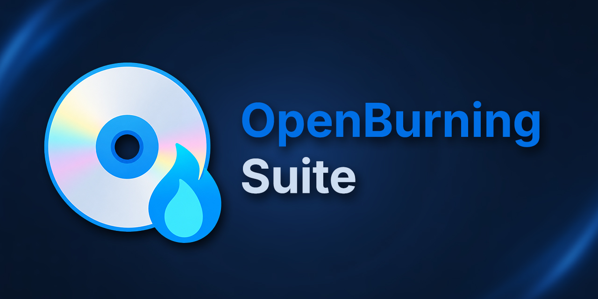
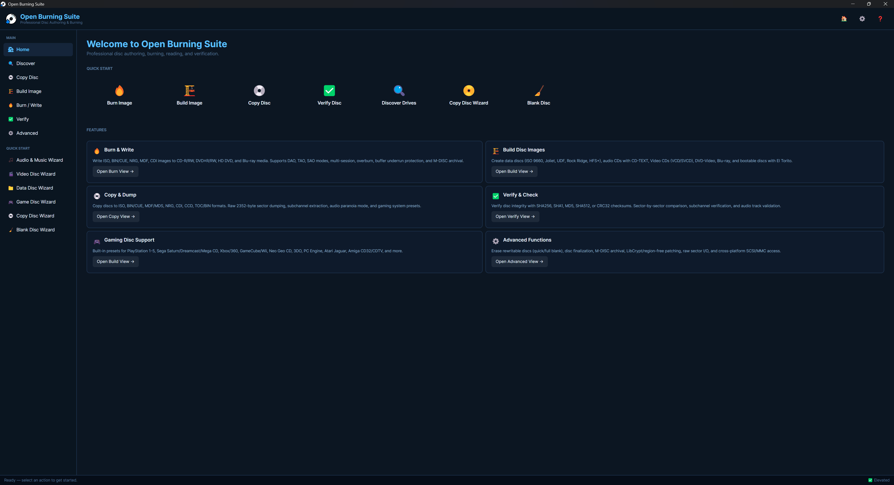

<div align="center">


# 🔥 Open Burning Suite

[](https://github.com/marcelofrau/OpenBurningSuite/actions/workflows/build-Windows.yml)
[](https://github.com/marcelofrau/OpenBurningSuite/actions/workflows/build-linux.yml)
[](https://github.com/marcelofrau/OpenBurningSuite/actions/workflows/build-macOS.yml)
[](https://dotnet.microsoft.com/)
[](LICENSE)
[]()

> **🚀 Active fork** by [marcelofrau](https://github.com/marcelofrau) — continuing development with new features, bug fixes, and UI improvements. Pull requests sent back upstream to keep the original project alive.
>
> 📖 **[Full documentation →](https://marcelofrau.github.io/OpenBurningSuite/)** | 💬 [Report issue](https://github.com/marcelofrau/OpenBurningSuite/issues)



</div>

---

## 📖 About

**Open Burning Suite** is a free, open-source disc burning application for **Windows**, **Linux**, and **macOS**. Burn, copy, create, and verify CDs, DVDs, HD DVDs, and Blu-ray discs — all from one app with a modern Fluent design interface.

Unlike most burning tools that rely on external CLI tools (`cdrecord`, `wodim`, `growisofs`), Open Burning Suite talks **directly** to your optical drive using native **SCSI/MMC commands**. No external dependencies, consistent behavior across platforms, and finer control over every operation.

Step-by-step wizards for audio, video, data, and gaming discs make it easy for beginners, while advanced options give experienced users full control over every burn parameter.

---

## ✨ Features

### 🔥 Burn Discs
| Mode | Description |
|:-----|:------------|
| **CD-R/RW** | Up to 99 min · TAO/SAO/DAO/RAW |
| **DVD±R/RW** | Single & dual layer · DVD-RAM |
| **HD DVD** | HD DVD-R/RW/RAM (SL/DL) |
| **Blu-ray** | BD-R/RE · BDXL 128 GB |
| **M-DISC** | DVD & BD M-DISC archival |
| **Write modes** | Build on the fly · Simulation · Overburn · Multi-copy · CUE sheets · Buffer underrun protection |

### 📀 Read Discs
| Output | Details |
|:-------|:--------|
| **ISO** | Standard disc image |
| **BIN/CUE** | Raw sector image with CUE sheet |
| **CHD** | MAME Compressed Hunks of Data |
| **CCD/IMG/SUB** | CloneCD format |
| **NRG** | Nero disc image |
| **MDF/MDS** | Alcohol 120% format |
| **IMG / CDI / TOC/BIN** | Additional formats |
| **VCD / SVCD / XSVCD** | Video CD formats |
| **Features** | Raw 2352-byte sectors · Subchannel extraction · Audio paranoia mode · Gaming presets |

### 🏗️ Build Images
- **File systems:** ISO 9660 · Joliet · UDF 1.02/2.01/2.50 · Rock Ridge · HFS+
- **Disc types:** Bootable El Torito · VCD/SVCD/XSVCD · Audio CD with CD-TEXT
- **Source:** Files and folders · Drag & drop · Mixed-mode discs

### 🎵 Audio
- **Create:** Audio CDs with CD-TEXT (artist, title, track names)
- **Rip:** Audio CDs to WAV or BIN/CUE with paranoia quality control
- **Import:** M3U, PLS, WPL, ASX playlist support
- **Copy:** Music files directly to disc

### 🎬 Video
- **DVD-Video:** Complete VIDEO_TS structure authoring
- **Blu-ray:** BDMV, BDAV recording format, Blu-ray 3D (MVC/SBS/TAB)
- **VCD/SVCD/XSVCD:** Legacy video CD formats
- **Transcoding:** FFmpeg-based with automatic format detection

### ✅ Verify
- **Checksums:** CRC32, MD5, SHA-1, SHA-256, SHA-512
- **Modes:** Sector-by-sector integrity · Disc-to-image comparison
- **Mixed-mode:** Proper pregap handling for mixed-mode CDs

### 🎮 Gaming Presets
Built-in presets for **20+ consoles**:

| Console | Format | Notes |
|:--------|:-------|:------|
| PlayStation 1–5 | CD/DVD/BD | LibCrypt, region-free patching |
| PSP | UMD | Read-only |
| Nintendo GameCube | miniDVD | Special burning mode |
| Nintendo Wii / Wii U | DVD/BD | SL & DL support |
| Sega Dreamcast | GD-ROM | CD-R compatible |
| Sega Saturn / Mega CD | CD-ROM | — |
| Xbox / 360 / One / Series | DVD/BD/BDXL | Xbox 360 stealth patching |
| Neo Geo CD / 3DO / CD-i | CD-ROM | — |
| Amiga CD32 / CDTV | CD-ROM | — |
| Atari Jaguar CD | CD-ROM | — |

### 🔒 Encryption
- **AES-256-CBC** disc image encryption with password protection (`.obse` format)
- **PS3 decryption** via IRD, dkey, and hex files
- Military-grade encryption for sensitive disc images

### 💿 Disc Info Panel
Detailed drive and media information at a glance:
- **Media ID (MID):** Manufacturer and dye type
- **ATIP (CD):** Absolute Time in Pregroove analysis
- **Physical Format:** DVD/BD physical format information
- **Write Speeds:** Supported speeds and strategies
- **Buffer Info:** Size, available, write buffer state
- **Firmware / Serial:** Drive identification
- **Manufacturer Lookup:** 150+ vendor codes database

### 🧙 Quick Start Wizards
Guided step-by-step workflows — no experience needed:

| Wizard | What it does |
|:-------|:-------------|
| 🎵 **Audio & Music** | Create audio CDs, rip, or copy music |
| 🎬 **Video Disc** | Author DVD-Video or Blu-ray |
| 📁 **Data Disc** | Burn files and folders to disc |
| 🎮 **Game Disc** | Console-specific gaming presets |
| 💿 **Copy Disc** | Duplicate discs with gaming & encryption options |
| 🧹 **Blank Disc** | Erase rewritable or format blank media |

### ⚙️ Advanced
- **Erase/Format:** Quick or full erase of rewritable media
- **Eject/Load:** Remote tray control
- **Finalization:** Close discs for playback compatibility
- **M-DISC Archival:** Long-term data preservation mode
- **Real-time visualization:** SkiaSharp-based disc surface monitor

---

## 📸 Screenshots

<details>
<summary><b>Click to expand screenshot gallery</b></summary>
<br>

| | |
|:---:|:---:|
| **Home Screen** | **Write / Burn View** |
|  |  |
| **Read View** | **Audio Wizard** |
|  |  |
| **Video Wizard** | **Disc Info Panel** |
|  |  |

</details>

---

## 🚀 Quick Start

```bash
# Clone
git clone https://github.com/marcelofrau/OpenBurningSuite.git
cd OpenBurningSuite

# Build & Run
dotnet build
dotnet run --project OpenBurningSuite
```

> 💡 **Prefer a pre-built release?** Download the latest from [Releases](https://github.com/marcelofrau/OpenBurningSuite/releases) — self-contained, no .NET SDK required.

### Build for Production
```bash
# Windows (x64)
dotnet publish -c Release -r win-x64 --self-contained

# Linux (x64)
dotnet publish -c Release -r linux-x64 --self-contained

# macOS (Apple Silicon)
dotnet publish -c Release -r osx-arm64 --self-contained
```

---

## 💻 Platform Notes

<details>
<summary><b>Windows</b></summary>

- **Run as Administrator** — SCSI passthrough requires elevation
- Windows 10 or later (x64, ARM64)
- Uses `IOCTL_SCSI_PASS_THROUGH_DIRECT` for hardware communication
- Installer: Inno Setup `.exe` available in releases

</details>

<details>
<summary><b>Linux</b></summary>

- **SCSI access** — Add user to `cdrom`/`optical` groups or run with `sudo`
- Device nodes: `/dev/sg*` and `/dev/sr*` required
- Kernel module: `sg` (SCSI generic) must be loaded
- Packages: DEB, RPM, APK, AppImage, Snap, Flatpak available
- See [LINUX.md](LINUX.md) for distribution-specific guides

</details>

<details>
<summary><b>macOS</b></summary>

- Uses IOKit `SCSITaskDeviceInterface` for SCSI access
- macOS may prompt for hardware access permissions
- macOS Sequoia+ may require **Full Disk Access** grant
- Packages: PKG and DMG available in releases
- See [macOS.md](macOS.md) for detailed setup

</details>

---

## 📦 Supported Media

| Category | Formats | Capacity |
|:---------|:--------|:---------|
| **CD** | CD-R, CD-RW | 74 / 80 / 90 / 99 min |
| **DVD** | DVD-R, DVD+R, DVD-RW, DVD+RW, DVD-R DL, DVD+R DL, DVD-RAM | 4.37 – 8.50 GB |
| **HD DVD** | HD DVD-R, HD DVD-R DL, HD DVD-RW, HD DVD-RAM | 15 – 30 GB |
| **Blu-ray** | BD-R, BD-RE, BD-R XL, BD-RE XL | 25 / 50 / 100 / 128 GB |
| **UHD Blu-ray** | UHD BD-66, UHD BD-100 | 66 – 100 GB |
| **M-DISC** | M-DISC DVD, M-DISC BD-R (SL / DL / XL) | Up to 128 GB |
| **Gaming** | GD-ROM (Dreamcast), miniDVD (GameCube), UMD (PSP) | Various |

Full reference: [Supported Formats](https://marcelofrau.github.io/OpenBurningSuite/supported-formats)

---

## 🔧 Optional External Tools

| Tool | Required for | Download |
|:-----|:-------------|:---------|
| **FFmpeg** | Video transcoding (DVD-Video, Blu-ray, BDAV, Blu-ray 3D, VCD/SVCD) | [ffmpeg.org](https://ffmpeg.org/) |
| **chdman** (MAME) | Reading/burning CHD (MAME Compressed Hunks of Data) format | [mamedev.org](https://mamedev.org/) |

Both tools must be available on your system PATH or configured in Open Burning Suite's Settings panel.

---

## 🧭 Documentation

| Guide | Description |
|:------|:------------|
| [Getting Started](https://marcelofrau.github.io/OpenBurningSuite/getting-started) | Installation, prerequisites, first run |
| [Burning Discs](https://marcelofrau.github.io/OpenBurningSuite/burning) | Burn images to optical media |
| [Reading Discs](https://marcelofrau.github.io/OpenBurningSuite/reading) | Read discs to image files |
| [Building Images](https://marcelofrau.github.io/OpenBurningSuite/building-images) | Create ISO and audio disc images |
| [Verification](https://marcelofrau.github.io/OpenBurningSuite/verification) | Verify discs and images |
| [Gaming Discs](https://marcelofrau.github.io/OpenBurningSuite/gaming-discs) | Console gaming formats |
| [Supported Formats](https://marcelofrau.github.io/OpenBurningSuite/supported-formats) | Complete media reference |
| [Architecture](https://marcelofrau.github.io/OpenBurningSuite/architecture) | Technical design docs |
| [FAQ](https://marcelofrau.github.io/OpenBurningSuite/faq) | Frequently asked questions |

---

## 🗺️ Project Status

See [Project Status](docs/status.md) for current progress, completed features, and planned work.

---

## 📜 Changelog

See [CHANGELOG.md](CHANGELOG.md) for full release history.

---

## 🖼️ Icon Attribution

| Source | License |
|:-------|:--------|
| [Icons8](https://icons8.com) | Free with attribution |
| [FluentUI System Icons](https://github.com/microsoft/fluentui-system-icons) — Microsoft | MIT |

---

## 📄 License

Distributed under the **BSD 2-Clause License**. See [`LICENSE`](LICENSE) for more information.
