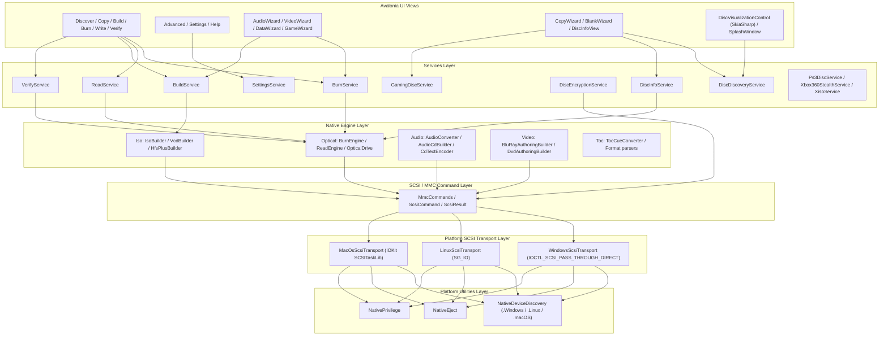
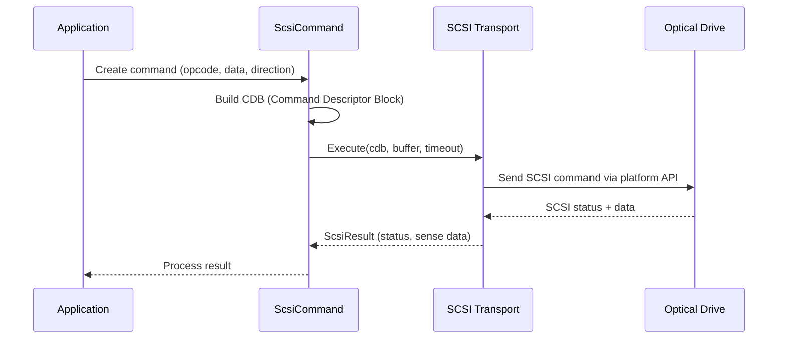
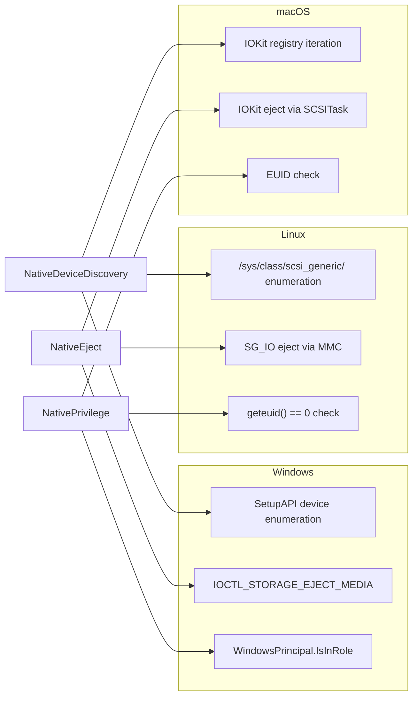
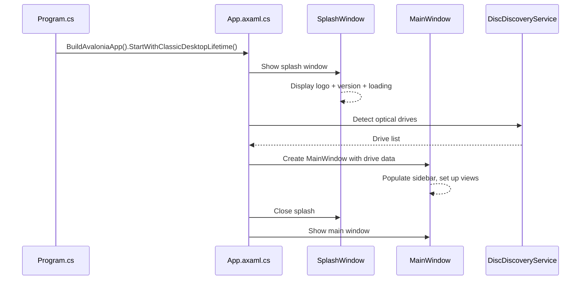
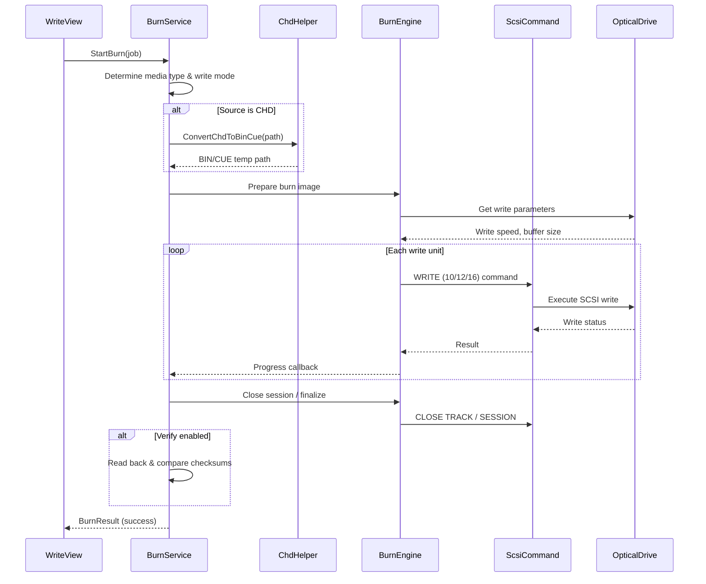
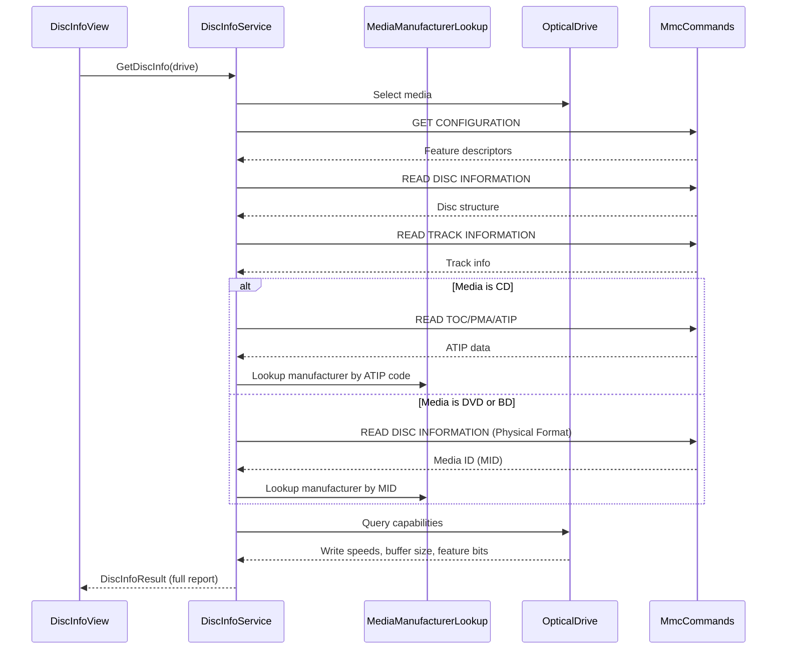
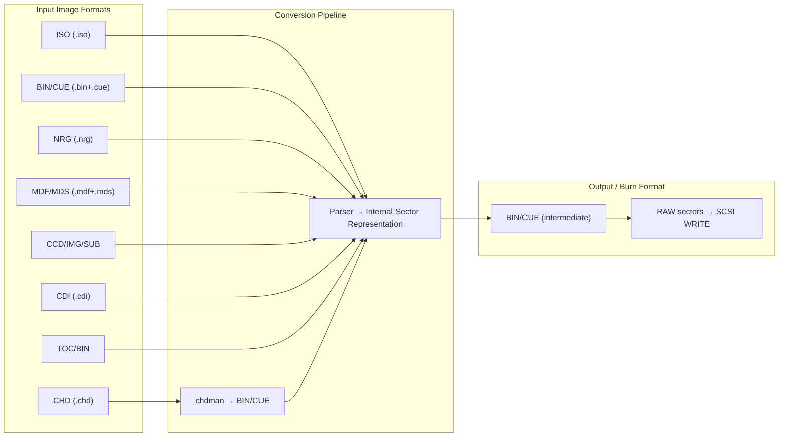
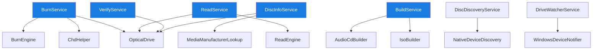

# Architecture & Internals

This page describes the technical architecture of Open Burning Suite, its layered design, and how the major components interact.

---

## High-Level Architecture

Open Burning Suite follows a clean **layered architecture** where each layer depends only on the layer below it:



---

## Layer Descriptions

### Avalonia UI Views

The top layer contains 16 views plus a splash window and a custom SkiaSharp-based disc visualization control. Views are primarily written in AXAML with C# code-behind, following a code-behind pattern (no formal MVVM framework — bindings are done manually via property change notification).

**View categories:**
- **Main operations:** Discover, Copy Disc, Build Image, Burn/Write, Verify
- **Configuration:** Advanced, Settings, Help
- **Quick Start Wizards:** Audio, Video, Data, Game, Copy, Blank/Erase
- **Information:** Disc Info panel, Disc Visualization
- **Overlay:** Splash Window (startup)

### Services Layer

Services encapsulate business logic for each major operation. They coordinate between views and the native engine layer:

| Service | Responsibility |
|:--------|:---------------|
| `BurnService` | Coordinates burn operations across media types, manages CHD conversion |
| `ReadService` | Handles disc reading to all output formats |
| `BuildService` | Creates ISO/UDF/HFS+ filesystem images |
| `VerifyService` | Performs checksum verification and disc-to-image comparison |
| `DiscDiscoveryService` | Detects and enumerates optical drives |
| `DiscInfoService` | Retrieves detailed disc/drive information (MID, ATIP, formats, speeds) |
| `DiscEncryptionService` | AES-256-CBC encryption/decryption of disc images (.obse) |
| `GamingDiscService` | Console-specific disc detection and preset logic |
| `SettingsService` | Persistent user settings (chdman path, preferences) |
| `Ps3DiscService` | PS3 IRD/dkey/hex decryption support |
| `Xbox360StealthService` | Xbox 360 stealth patching |

### Native Engine Layer

The engine layer implements the actual disc operations. It is split into domains:

**Optical Engine:**
- `BurnEngine` — SCSI WRITE commands, buffer management, burn strategy
- `ReadEngine` — SCSI READ commands, sector extraction, error recovery
- `OpticalDrive` — Drive capabilities, media type detection, speed negotiation

**Iso/Disc Image Engine:**
- `IsoBuilder`, `VcdBuilder`, `HfsPlusBuilder` — filesystem image creation
- `RockRidgeExtensions` / `RockRidgeReader` — POSIX extensions
- `CcdParser`/`Writer`, `CdiParser`/`Writer`, `MdfParser`/`Writer` — format support
- `NrgParser`/`Writer`, `ImgParser`/`Writer` — additional format support

**Audio Engine:**
- `AudioConverter` — Audio file transcoding
- `AudioCdBuilder` — Red Book audio CD creation with CD-TEXT
- `CdTextEncoder` — CD-TEXT pack encoding
- `PlaylistParser` — M3U/PLS/WPL/ASX import

**Video Engine:**
- `BluRayAuthoringBuilder` — BDMV/BDAV structure authoring
- `DvdAuthoringBuilder` — VIDEO_TS structure authoring
- `VideoTranscoder` — FFmpeg video transcoding adapter

### SCSI / MMC Command Layer

This layer defines the SCSI command set used for optical drive communication:



Key components:
- `MmcCommands` — Static definitions of MMC opcodes and parameter pages
- `ScsiCommand` — Encapsulates CDB construction, buffer allocation, timeout handling
- `ScsiResult` — Parses sense data, extracts error information

### Platform SCSI Transport Layer

Each platform has its own SCSI transport implementation behind the `IScsiTransport` interface:

| Platform | Implementation | API |
|:---------|:---------------|:----|
| Windows | `WindowsScsiTransport` | `IOCTL_SCSI_PASS_THROUGH_DIRECT` via `DeviceIoControl` |
| Linux | `LinuxScsiTransport` | `SG_IO` ioctl on `/dev/sg*` |
| macOS | `MacOsScsiTransport` | IOKit `SCSITaskDeviceInterface` |

The factory pattern (`ScsiTransportFactory`) selects the correct transport at runtime based on `OSPlatform`.

### Platform Utilities Layer

Cross-platform helpers for system integration:



---

## Application Startup Flow



---

## Burn Operation Flow



---

## Disc Information Retrieval



---

## Key Design Decisions

### Why Native SCSI Instead of CLI Tools?

Unlike most disc burning applications that wrap command-line tools (`cdrecord`, `wodim`, `growisofs`, `mkisofs`), Open Burning Suite communicates directly with the optical drive:

- **No external dependencies** — the application is self-contained
- **Consistent behavior** — same SCSI commands on every platform
- **Better error reporting** — direct access to sense data and drive status
- **Finer control** — raw sector access, subchannel data, custom write modes

### Code Example: Executing a SCSI Command

```csharp
// From ScsiCommand.cs — simplified
public ScsiResult Execute(IScsiTransport transport, byte[] cdb,
                          byte[] buffer, int timeoutMs)
{
    var result = transport.Execute(cdb, buffer, timeoutMs);

    if (result.Status == ScsiStatus.CheckCondition)
    {
        var sense = SenseData.Parse(result.SenseBuffer);
        if (sense.IsRecoverableError)
            return new ScsiResult(result.Data, sense, isWarning: true);

        throw new ScsiException(sense);
    }

    return new ScsiResult(result.Data, senseData: null);
}
```

### Why Code-Behind Instead of MVVM?

The original upstream project used code-behind for view logic. This fork maintains that pattern for consistency and incremental migration. New features (Disc Info, Icon system) introduce helper classes and services that can be extracted into a formal ViewModel layer in a future refactor.

---

## SCSI Command Categories

| Category | Commands | Example Opcodes |
|:---------|:---------|:----------------|
| **Inquiry** | GET CONFIGURATION, FEATURE, EVENT STATUS | 46h, 4Ah, 4Dh |
| **Read** | READ (10/12/16), READ CD, READ TOC/PMA/ATIP | 28h, A8h, BEh |
| **Write** | WRITE (10/12/16), WRITE AND VERIFY | 2Ah, AAh, 2Eh |
| **Session** | CLOSE TRACK/SESSION, RESERVE TRACK, SYNCHRONIZE CACHE | 5Bh, 53h, 35h |
| **Media** | READ DISC INFORMATION, READ TRACK INFORMATION | 51h, 52h |
| **Mode** | MODE SENSE (6/10), MODE SELECT (6/10) | 1Ah, 5Ah, 15h, 55h |
| **Misc** | START STOP UNIT, PREVENT ALLOW MEDIUM REMOVAL, LOAD/UNLOAD MEDIUM | 1Bh, 1Eh, A6h |

---

## Image Format Support Pipeline



---

## Service Dependencies



---

## Project Structure

```
OpenBurningSuite/
├── OpenBurningSuite.slnx        # Solution file (.slnx format)
├── OpenBurningSuite.csproj      # .NET 8 project
├── Program.cs                   # Entry point
├── App.axaml / App.axaml.cs     # Application + theme
│
├── Models/                      # Data models
│   ├── AppSettings.cs           # User configuration
│   ├── BurnJob.cs               # Burn operation parameters
│   ├── BurnProgress.cs          # Burn progress tracking
│   ├── DiscDrive.cs             # Drive representation
│   ├── DiscInfoResult.cs        # Disc information result
│   └── ...                      # (20+ model classes)
│
├── Services/                    # Business logic
│   ├── BurnService.cs
│   ├── ReadService.cs
│   ├── BuildService.cs
│   ├── VerifyService.cs
│   ├── DiscInfoService.cs
│   ├── DiscDiscoveryService.cs
│   ├── DiscEncryptionService.cs
│   ├── GamingDiscService.cs
│   └── ...
│
├── Native/                      # Native engine
│   ├── Optical/                 # BurnEngine, ReadEngine, OpticalDrive
│   ├── Audio/                   # AudioCdBuilder, AudioConverter
│   ├── Video/                   # VideoTranscoder, BluRay/DVD authoring
│   ├── Scsi/                    # SCSI commands + platform transports
│   ├── Platform/                # NativeDeviceDiscovery, Eject, Privilege
│   └── Toc/                     # TOC/CUE conversion
│
├── Controls/                    # Custom Avalonia controls
│   ├── IconButton.cs
│   ├── IconTextBlock.cs
│   ├── IconConverter.cs
│   └── IconSourceExtension.cs
│
├── Helpers/                     # Utilities
│   ├── ChdHelper.cs             # CHD extraction via chdman
│   ├── IconHelper.cs            # PNG icon loading
│   ├── Logger.cs                # Logging with ms precision
│   └── MediaManufacturerLookup.cs  # 150+ vendor IDs
│
└── Views/                       # AXAML views (16 views + splash)
    ├── MainWindow.axaml/.cs
    ├── SplashWindow.axaml/.cs
    ├── WriteView.axaml/.cs
    ├── ReadView.axaml/.cs
    ├── DiscInfoView.axaml/.cs
    └── ...
```
